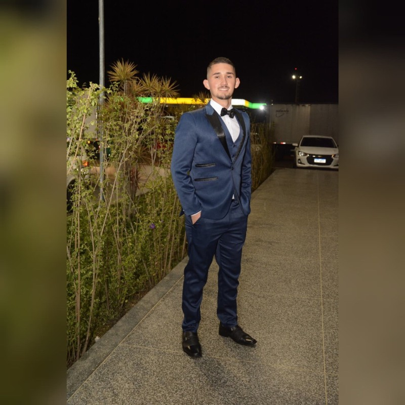

  
  <h1 style="color: #00b4d8; text-shadow: 2px 2px 4px rgba(0,0,0,0.1); animation: slide-in 1s ease-out;">Renan Dirceu de Almeida</h1>
  
<strong>🚀 Desenvolvedor Full Stack | Back-End | DevOps</strong>

  

    
    
  

  

    
    
    
  

## 💫 Sobre Mim

Desenvolvedor apaixonado por tecnologia, especializado na criação de sistemas robustos e escaláveis. Minha experiência abrange desde o desenvolvimento back-end até práticas DevOps, sempre buscando soluções inovadoras e eficientes para desafios complexos.

- 🎯 **Foco atual:** Desenvolvimento Full Stack e Arquitetura de Software
- 📚 **Estudando:** Cloud Architecture e Microservices
- 🌱 **Interesses:** Inteligência Artificial e Machine Learning
- 💡 **Objetivo:** Criar soluções que impactam positivamente a vida das pessoas

## 🛠️ Stack Tecnológica

### 🔙 Back-End

### 🎨 Front-End

### ☁️ DevOps & Cloud

### 💾 Banco de Dados

## 💼 Experiência Profissional

### 🏢 Artean Tecnologia
**Desenvolvedor Full Stack Senior**
- 🔹 Desenvolvimento de sistemas web com Delphi e React
- 🔹 Implementação de APIs RESTful
- 🔹 Otimização de sistemas de backup
- 🔹 Gerenciamento de segurança e permissões
- 🔹 Desenvolvimento Frontend com HTML5, CSS3 e React.js
- 🔹 Integração com serviços AWS
- 🔹 Manutenção e desenvolvimento de aplicações em Python

### 🏛️ Câmara Municipal de Curitiba
**Analista de Sistemas**
- 🔹 Administração de bancos de dados
- 🔹 Suporte técnico N1/N2/N3
- 🔹 Configuração e manutenção de servidores
- 🔹 Implementação de soluções de segurança
- 🔹 Otimização de processos internos

## 🎓 Formação Acadêmica

### 🎓 Universidade Positivo
**Tecnólogo em Análise e Desenvolvimento de Sistemas**
- 📅 Abril/2025 - Dezembro/2027
- 📍 Curitiba, PR
- 🎯 Foco em Desenvolvimento Web e Mobile

### 🔧 SENAI
**Tecnólogo em Desenvolvimento de Sistemas**
- 📅 Julho/2023 - Dezembro/2024
- 📍 Curitiba, PR
- 🎯 Foco em Programação e Arquitetura de Software

## 📊 Estatísticas GitHub

  
  

## 🏆 Conquistas GitHub

  

## 📈 Visitantes

  

## 📫 Contato

  <h3 style="color: #00b4d8;">Vamos Conectar!</h3>
  
Estou sempre aberto a novas oportunidades e colaborações!

  
  

    <a href="mailto:tatusage@gmail.com" style="text-decoration: none; color: #00b4d8; background: rgba(0,180,216,0.1); padding: 10px 20px; border-radius: 8px; transition: all 0.3s ease;">
      📧 tatusage@gmail.com
    </a>
    <a href="https://www.linkedin.com/in/renan-dirceu-de-almeida-16645025a/" style="text-decoration: none; color: #00b4d8; background: rgba(0,180,216,0.1); padding: 10px 20px; border-radius: 8px; transition: all 0.3s ease;">
      💼 LinkedIn
    </a>
    <a href="https://renan-kappa.vercel.app" style="text-decoration: none; color: #00b4d8; background: rgba(0,180,216,0.1); padding: 10px 20px; border-radius: 8px; transition: all 0.3s ease;">
      🌐 Portfolio
    </a>
  

